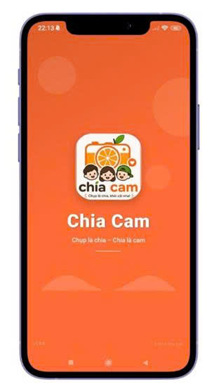
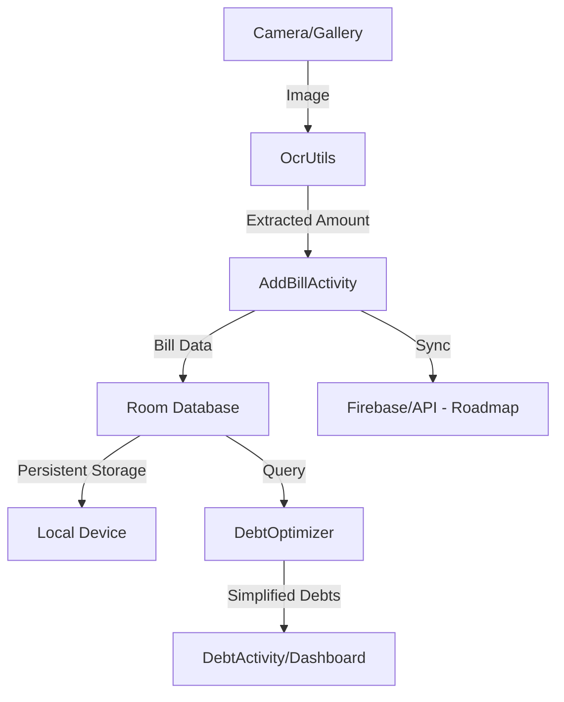

# Chia Cam 🍊 - Ứng dụng Chia Hóa Đơn Thông Minh

[](https://developer.android.com)
[](https://www.java.com)
[](LICENSE)
[](https://developers.google.com/ml-kit)

**Chia Cam** là giải pháp toàn diện giúp bạn và nhóm bạn quản lý chi tiêu chung một cách minh bạch, nhanh chóng và hiện đại. Không còn nỗi lo cộng trừ thủ công hay nhầm lẫn số tiền, hãy để **Chia Cam** lo liệu mọi thứ!

---

## 📸 Giao diện ứng dụng


*Giao diện dashboard hiện đại với tông màu cam chủ đạo.*

---

## 🚀 Tính Năng Nổi Bật

*   **⚡ Nhận diện thông minh (OCR):** Tự động bóc tách số tiền từ hóa đơn chỉ bằng một cú chạm.
*   **⚖️ Chia tiền đa phương thức:** 
    *   **Equal Split:** Chia đều cho tất cả.
    *   **Percentage Split:** Chia theo tỷ trọng phần trăm.
    *   **Custom Split:** Chia theo số tiền cụ thể của từng người.
*   **🧩 Tối ưu hóa dòng tiền:** Thuật toán tự động giảm thiểu số lượng giao dịch cần thực hiện để trả hết nợ trong nhóm.
*   **📡 Đồng bộ hóa (Sắp có):** Kết nối dữ liệu thời gian thực giữa các thiết bị thành viên qua Cloud.
*   **🌙 Chế độ tối (Dark Mode):** Giao diện thân thiện, bảo vệ mắt và tiết kiệm pin.

---

## 🏗️ Kiến Trúc Hệ Thống



---

## 🛠️ Stack Công Nghệ

| Thành phần | Công nghệ sử dụng |
| :--- | :--- |
| **Language** | Java 11+ |
| **Core UI** | Material Design Components, RecyclerView, CoordinatorLayout |
| **Architecture** | MVVM Pattern |
| **Local DB** | Room Persistence Library |
| **Imaging** | CameraX, Glide, BitmapUtils |
| **Intelligence** | Google ML Kit (Text Recognition) |
| **Background** | WorkManager, ThreadPoolExecutor |

---

## 📂 Cấu Trúc Thư Mục

```bash
com.chupchia/
├── activities/    # Điều phối giao diện và tương tác người dùng
├── adapters/      # Cầu nối dữ liệu cho danh sách (RecyclerView)
├── database/      # Quản lý lưu trữ cục bộ (SQLite/Room)
├── dialogs/       # Các hộp thoại tương tác nhanh
├── fragments/     # Thành phần UI tái sử dụng
├── models/        # Định nghĩa cấu trúc dữ liệu
├── repositories/  # Lớp trừu tượng quản lý dữ liệu
└── utils/         # Các tiện ích cốt lõi (OCR, Định dạng, Tối ưu)
```

---

## 🗺️ Lộ Trình Phát Triển (Roadmap)

- [x] Hoàn thiện giao diện Material Design 3.
- [x] Tích hợp OCR nhận diện hóa đơn cơ bản.
- [x] Thuật toán tối ưu hóa công nợ.
- [ ] Tích hợp Firebase Auth và Cloud Firestore để đồng bộ nhóm.
- [ ] Hỗ trợ đa tiền tệ (VND, USD, KRW...).
- [ ] Xuất báo cáo chi tiêu hàng tháng (PDF/Excel).
- [ ] Tính năng quét QR chuyển khoản nhanh qua Napas247.

---

## ⚙️ Cài đặt & Sử dụng

1.  Mở dự án trong **Android Studio Ladybug**.
2.  Đảm bảo đã cài đặt Android SDK API 34.
3.  Kết nối thiết bị thật (ưu tiên) hoặc máy ảo.
4.  Nhấn `Run` để trải nghiệm.

---

## 👤 Tác giả

*   **Phan Đình Mạnh** - *Lead Developer* - [GitHub Profile](https://github.com/MANH-IT)

---

© 2026 Chia Cam Project. Phát triển với ❤️ dành cho cộng đồng.
